# MyLauncher

> 绿色便携程序管理器 —— 把你的软件、游戏、网址、文件夹统统收进一个窗口，一键启动。

MyLauncher 是一款 Windows 桌面应用，帮你把散落在各个磁盘和目录下的程序、游戏、网址、文件夹、系统功能统一收录到一个界面中，按分类整理，双击即可启动。整个程序无需安装，拷贝即用。

## 功能特性

- **多类型收录** — 支持添加程序（exe）、网址、文件夹、文件、系统功能、UWP 应用
- **分类管理** — 多级分类树，支持拖拽排序和移动层级
- **4 种视图** — 图标网格、竖向卡片、横向卡片、表格列表，每个分类独立设置
- **多环境支持** — 同一程序在不同电脑可配置不同路径，相对/绝对路径互转
- **自动图标提取** — 程序、文件、文件夹自动提取 Windows 系统图标，网址自动抓取 favicon
- **拖拽添加** — 直接把 exe 或快捷方式拖进窗口，自动识别名称和图标
- **文件夹扫描** — 指定目录递归扫描 exe，批量添加
- **书签导入** — 解析浏览器导出的书签 HTML 文件，批量导入网址收藏
- **批量操作** — 批量删除、移动分类、转换路径模式、重新提取图标
- **系统托盘** — 关闭窗口隐藏到托盘，双击恢复
- **开机自启** — 支持静默启动（开机不弹窗，只留托盘图标）
- **明暗主题** — 明亮 / 暗黑 / 跟随系统
- **过期资源清理** — 删除条目后自动清理无人引用的图标和封面（移入回收站，可还原）

## 截图

### 明亮主题

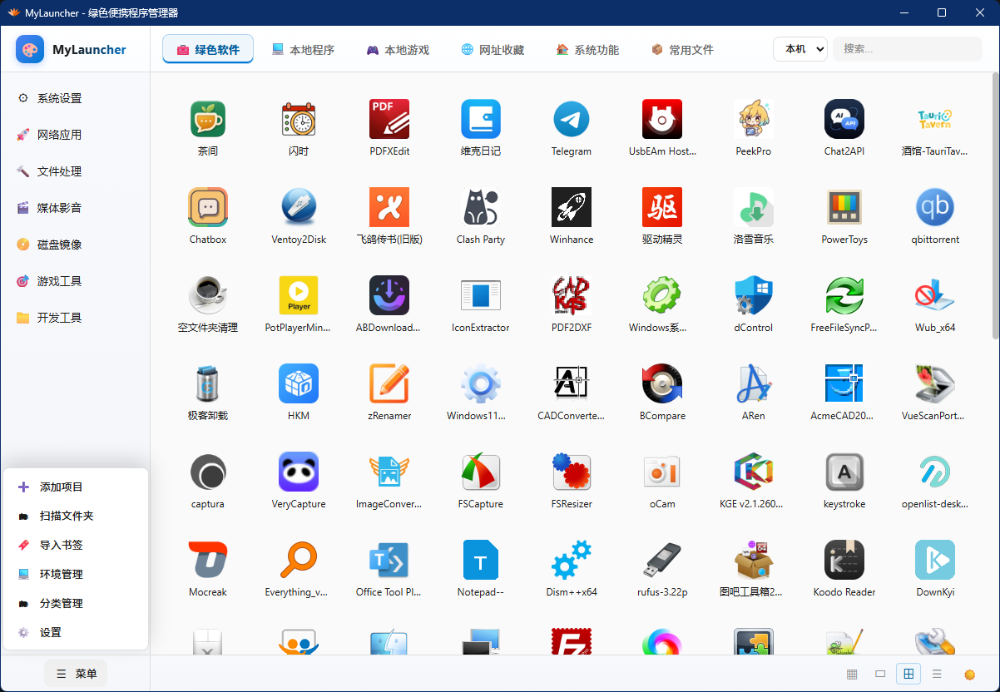

### 暗黑主题

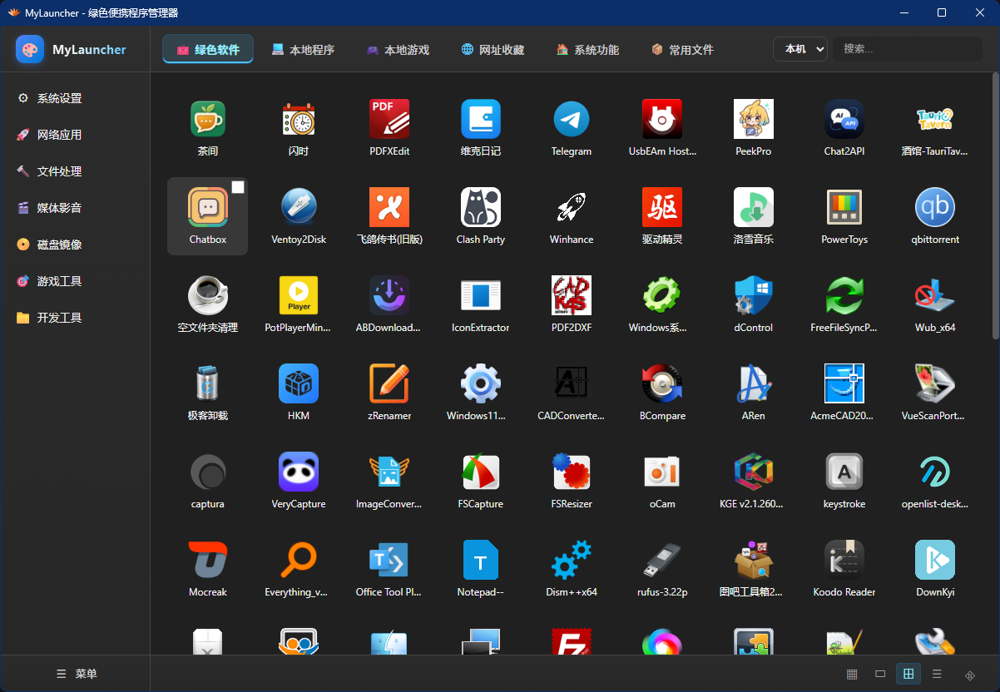

### 添加程序

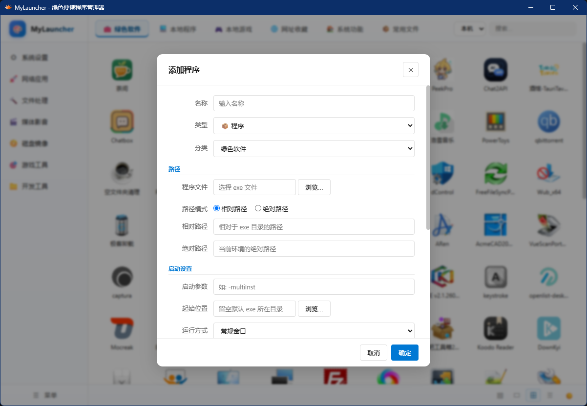

### 项目编辑

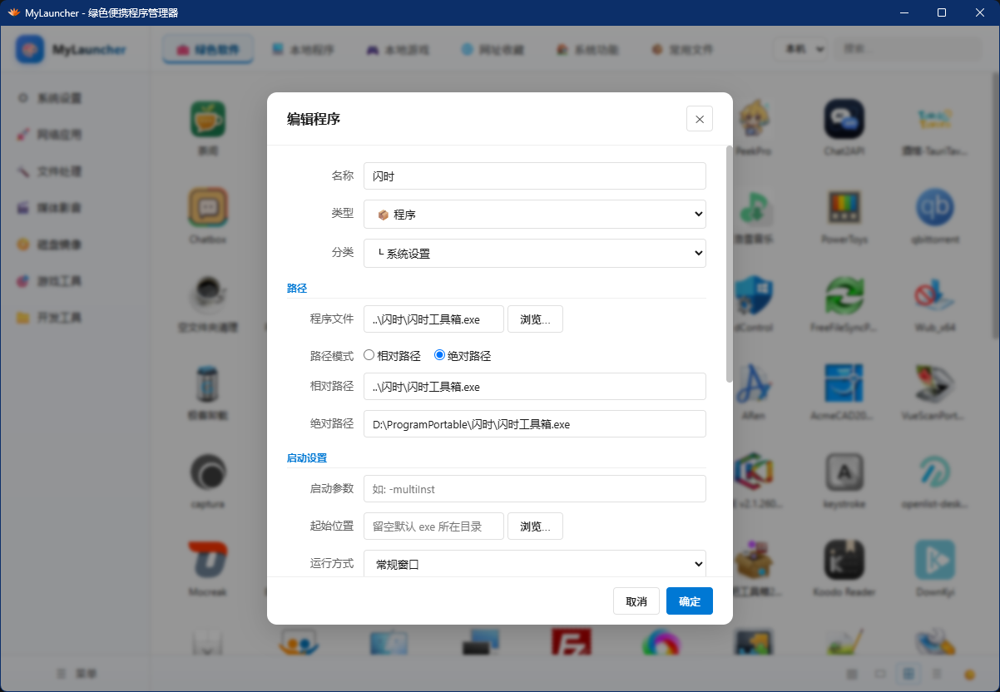

### 分类管理

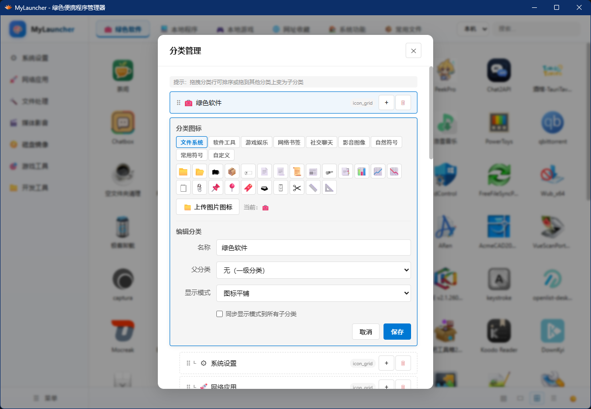

### 竖向卡片视图


### 横向卡片视图

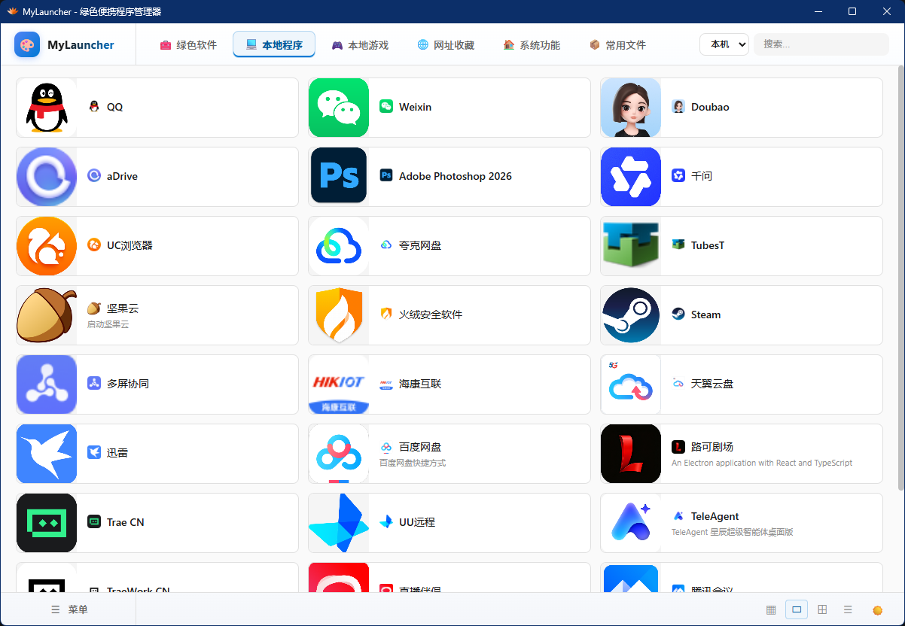

### 表格列表视图

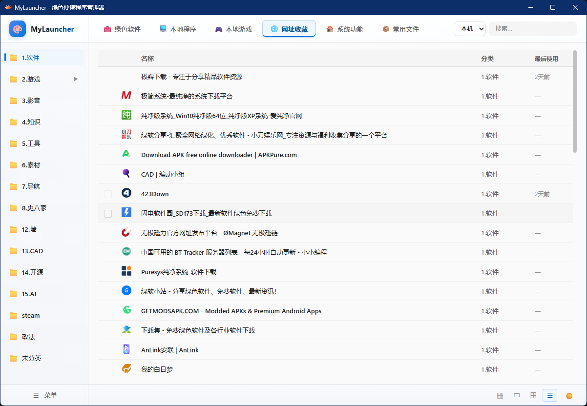

### 可添加系统功能

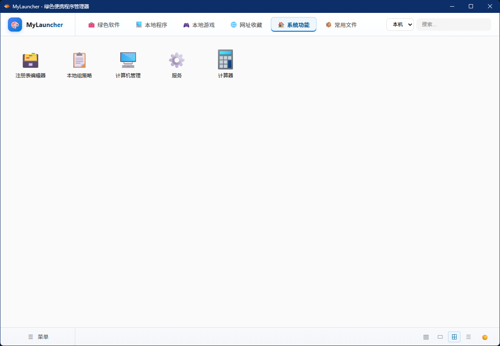

### 可添加文件和文件夹

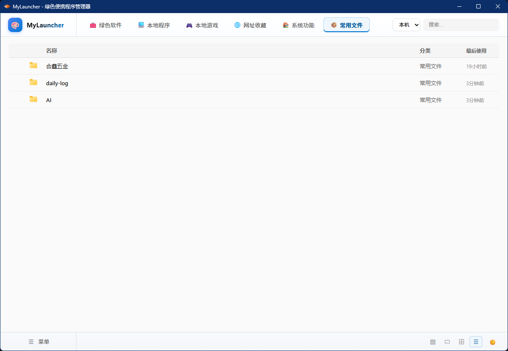

### 文件夹扫描

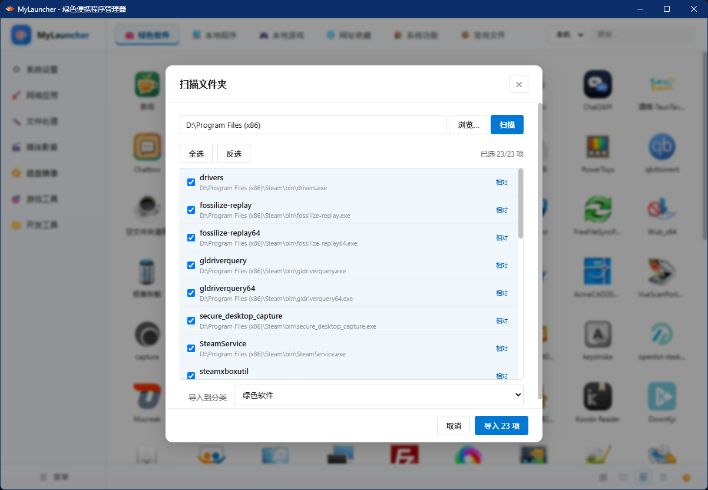

### 浏览器书签导入

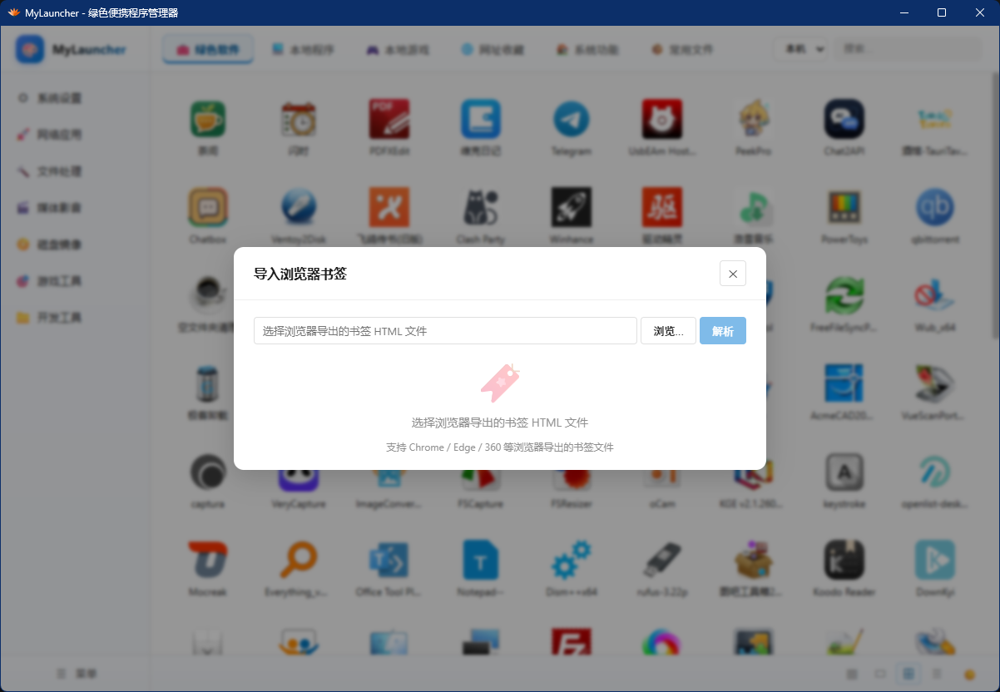

### 多环境路径管理

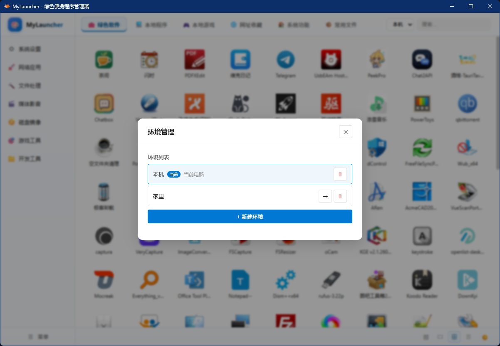

### 设置

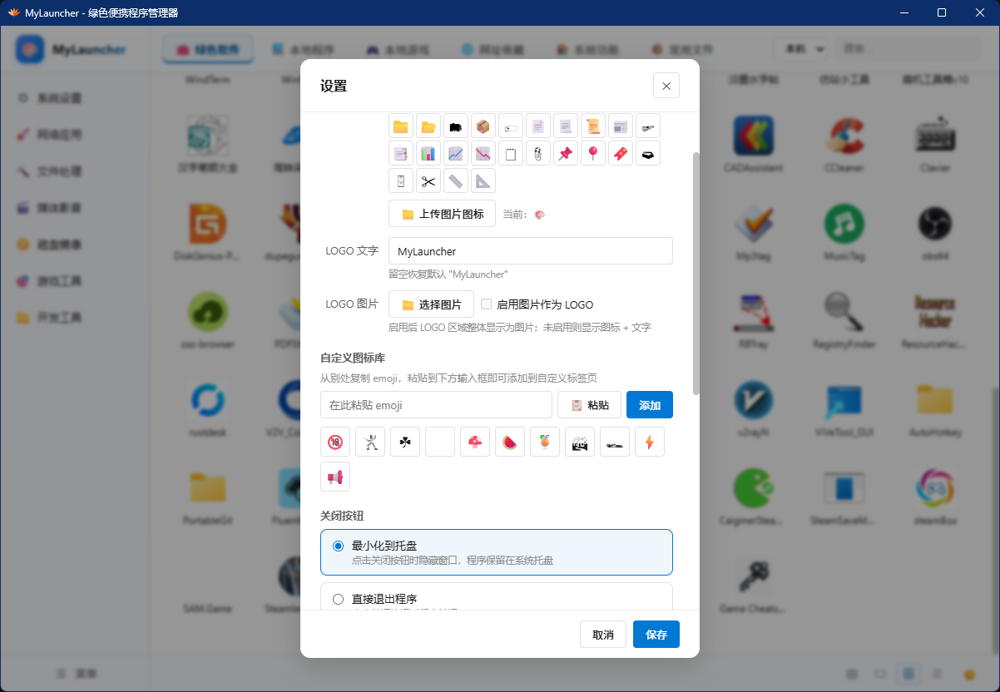

### 关于

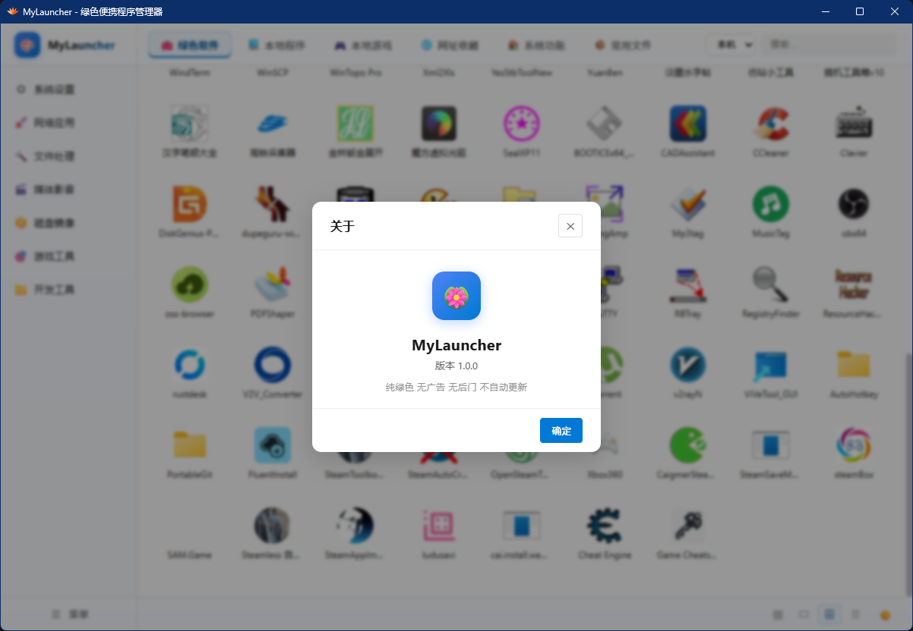

## 技术栈

| 层面     | 技术                                           |
| -------- | ---------------------------------------------- |
| 桌面框架 | **Tauri v2**                                   |
| 前端     | **Vue 3** + **TypeScript** + **Vite**          |
| 后端     | **Rust**（2021 edition）                       |
| 样式     | 纯 CSS（Fluent Design 风格，CSS 变量主题切换） |
| 状态管理 | Vue 3 内置 `reactive`（无第三方库）            |

## 快速开始

### 环境准备

- [Node.js](https://nodejs.org/) 18+
- [Rust](https://www.rust-lang.org/tools/install) 2021 edition
- Windows 10/11（需要 WebView2，Win11 已内置）

### 开发运行

```bash
# 进入前端目录
cd MyLauncher-src

# 安装依赖
npm install

# 启动开发模式（前端 + Rust 后端同时运行）
npm run tauri dev
```

### 打包发布

```bash
npm run tauri build
```

打包产物在 `src-tauri/target/release/` 下。

## 项目结构

```
MyLauncher-src/
├── src/                          # 前端源码
│   ├── App.vue                   # 根组件（布局 + 对话框 + 拖拽 + 右键菜单）
│   ├── api/index.ts              # Tauri 命令封装层
│   ├── store/index.ts            # 全局状态管理
│   ├── types/index.ts            # TypeScript 类型定义
│   ├── components/               # 组件
│   │   ├── nav/                  # 导航栏（顶部/侧栏/底部）
│   │   ├── views/                # 4 种视图组件
│   │   └── dialogs/              # 各类对话框
│   ├── composables/              # Vue 组合式函数
│   ├── data/                     # 静态数据（emoji、系统功能列表）
│   └── styles/                   # 全局样式
│
└── src-tauri/                    # Rust 后端
    └── src/lib.rs                # 核心逻辑（数据持久化、图标提取、程序启动等）
```

## 数据存储

所有数据以 JSON 文件保存在程序同目录的 `data/` 文件夹下，不依赖数据库：

```
data/
├── config.json          # 应用配置
├── categories.json      # 分类列表
├── entries.json         # 条目列表
└── environments.json    # 环境列表
```

图标和封面保存在 `assets/` 文件夹下。

## 绿色便携

- 所有数据和资源都在 exe 同目录，不写 AppData、不写注册表（除自启功能外）
- 同盘符内的程序自动使用相对路径（`..\..\` 形式）
- 整个文件夹拷贝到 U 盘或另一台电脑即可使用
- 换了环境路径失效时会标红提醒

## 许可证

MIT

## 此项目完全由teleagent人工智能完成
